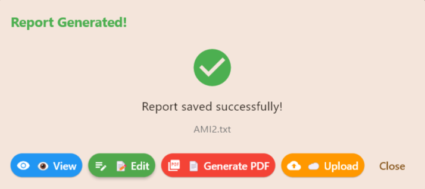
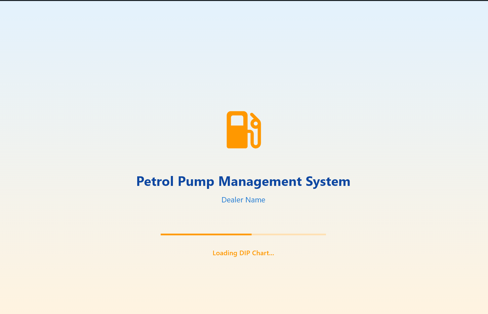
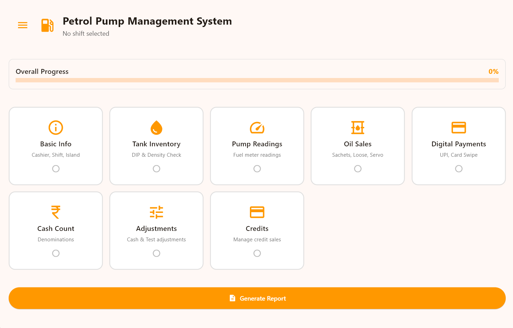
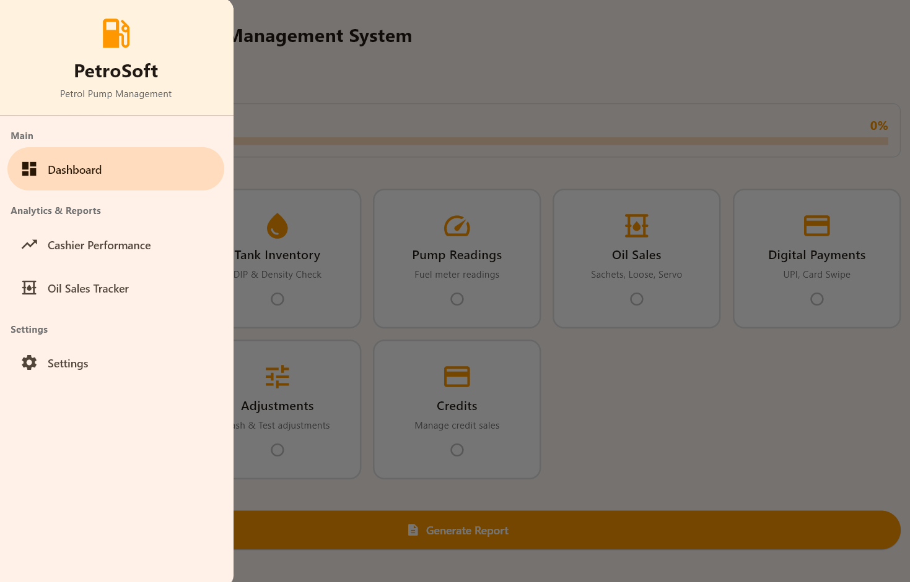
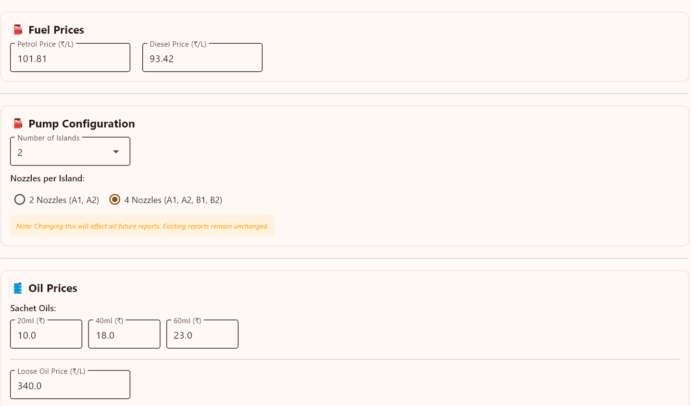
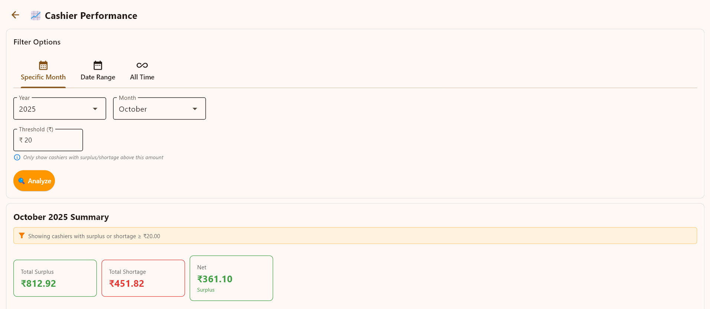
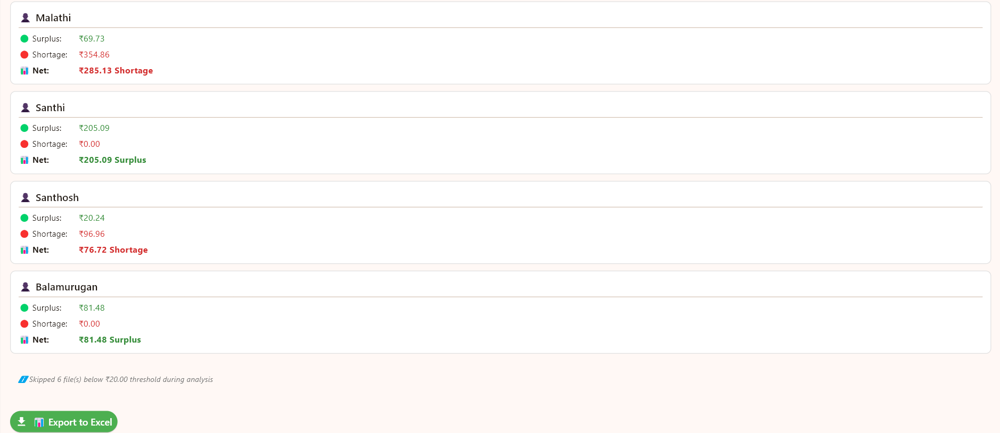
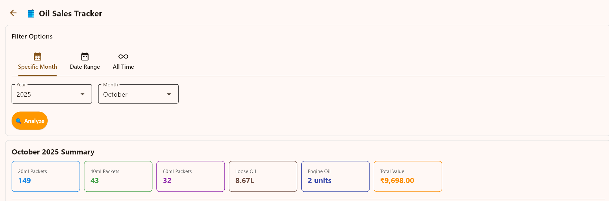
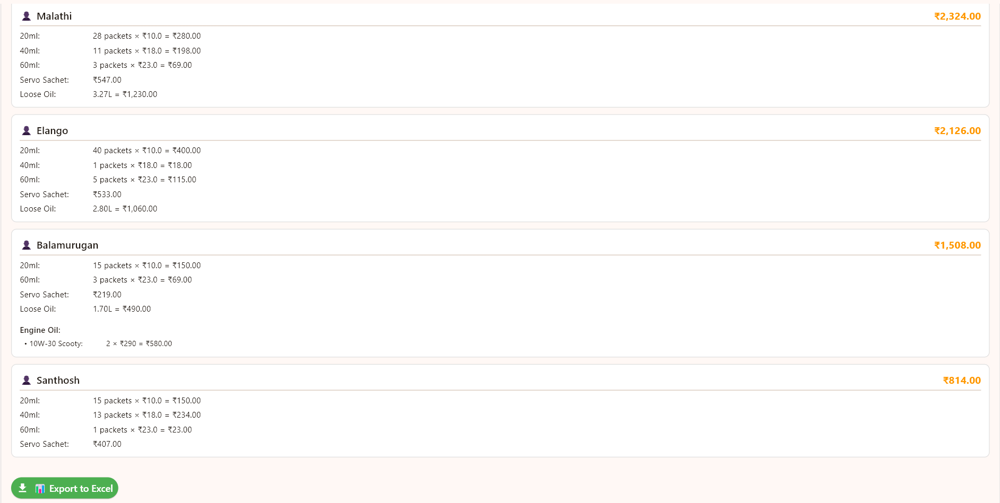
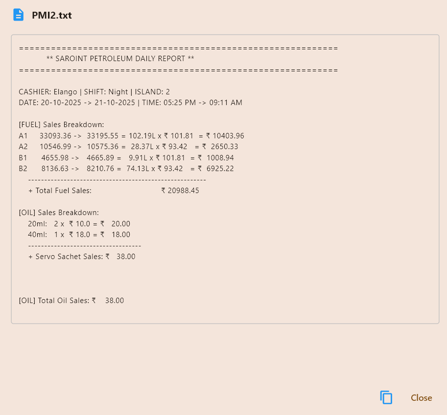

# 🚀 PetroSoft - Petrol Pump Management System

**End Your DSR Headaches! Automated Daily Sales Reports in Minutes**

---

## 💡 The Problem We Solve

**Tired of spending 2-3 hours daily on DSR calculations?**

- ❌ Manual tank dip volume calculations
- ❌ Confusing meter reading math
- ❌ Cash counting errors
- ❌ Credit tracking mess
- ❌ Variance calculations giving you headaches
- ❌ Making Excel sheets from scratch daily

### ✅ PetroSoft Does It All in 5 Minutes!

**Just enter the readings → We calculate everything → Professional reports ready!**

No more calculators, no more Excel formulas, no more DSR stress!

---

## 🎯 What PetroSoft Does

### The Smart Way to Handle DSR

1. **Enter tank dip** → We calculate volume (20KL tanks)
2. **Enter pump readings** → We calculate sales
3. **Count cash** → We calculate totals
4. **Add credits** → We track everything
5. **Click Generate** → Done! ✅

**Everything is automated. Everything is accurate. Every single time.**

---

## ✨ Key Features

### 📊 Automatic Calculations (Your Brain Can Rest!)

- **Tank Dip to Volume** - No more dip charts! Enter cm, get liters instantly (20KL tanks)
- **Fuel Density Calculator** - Calculate MS/HSD density automatically
- **Pump Sales** - Opening + Closing readings = Sales (we do the math!)
- **Cash Variance** - Expected vs Actual = Surplus/Shortage (no calculator needed!)
- **Credit Tracking** - Customer credits tracked with daily totals

### 📈 Professional Reports (Impress Everyone!)

- **Text Report (.txt)** - Complete daily report for each pump
- **MS Sales Report(.xlsx)** - Petrol sales with density & stock
- **HSD Sales Report(.xlsx)** - Diesel sales with density & stock  
- **Daily INR Sales(.xlsx)** - 24-hour sales in ₹ with charts
- **PDF Reports(.pdf)** - Professional printouts with your company watermark

### 💰 Financial Management

- **Credit System** - Track all customer credits
- **Digital Payments** - UPI, Cards categorized
- **Cash Counter** - Denomination-wise (₹500 to ₹1)
- **Adjustments** - Expenses, shortages tracked

### ☁️ Google Drive Backup (Optional)

- **Disabled by default** - Your choice to enable
- Auto-upload reports to Drive
- Never lose data
- Access from anywhere

### 📊 Analytics & Insights

- **Cashier Performance** - Who's accurate? Who has shortages?
- **Oil Sales Trends** - What's selling? What's not?
- **Daily/Monthly Charts** - Visual insights

---

## 💻 System Requirements

- **Windows 10 or 11** (64-bit)
- **1 GB free disk space**
- That's it! 

---

## 📥 Installation

1. **Run** [PetroSoft_Setup.exe](https://github.com/Mamallann/PetrolPump-Management-Software---PetroSoft/releases/)
2. **Click** "Install"
3. **Done!** Launch from desktop

**First Launch**: 14-day free trial starts automatically (Full access, no credit card!)

---

## 🎬 How to Use

### First Time Setup (One Time Only!)

**Go to Settings** (☰ menu → Settings):

1. **Company Details** - Your pump name, dealer name
2. **Pump Config** - Islands, nozzles, fuel rates
3. **Labours name** - All your labours name
4. **That's it!** You're ready to go

### Daily Usage (Takes 5 Minutes!)

**Dashboard shows all pages** - Click to fill each section:

#### 1. Basic Info
- Island number (1, 2, 3...)
- Shift (Day: 6AM-6PM / Night: 6PM-6AM)
- Date

#### 2. Tank Dip (20KL Tanks)
- Enter **opening dip only** (in cm)
- System calculates volume automatically
- **Calculate density** - Get MS/HSD density (updates in reports!)

#### 3. Pump Readings
- Opening meter reading
- Closing meter reading
- Sales calculated automatically!

#### 4. Oil Sales
- Sachets, Loose oil, Servo
- Opening stock, purchases, sales

#### 5. Digital Payments
- UPI amounts (GPay, PhonePe, etc.)
- Card payments

#### 6. Cash Count
- Count by denomination
- Total calculated automatically

#### 7. Credits
- Add customer credits with name & amount

#### 8. Adjustments
- Expenses, shortages, surpluses

#### 9. Generate Report! 🎉

**Click "Generate Report"** - Creates:

✅ **AMI1.txt** (Island 1, Morning shift)  
✅ **PMI2.txt** (Island 2, Evening shift)  
✅ **MS_Sales.xlsx** (Petrol with density & stock)  
✅ **HSD_Sales.xlsx** (Diesel with density & stock)  
✅ **Daily_INR_Sales.xlsx** (24hr sales in ₹ with charts)

**Saved in**: `records/reports/2025/01/20/` (organized by date!)

**Then you can**:
- 👁️ **View** - Read in-app
- 📝 **Edit** - Open in Notepad
- 📄 **Render PDF** - Professional printout
- ☁️ **Upload** - Google Drive backup (if enabled)

---

## ☁️ Google Drive Setup (Optional)

**Google Drive is OFF by default.** Enable only if you want cloud backup.

### Quick Setup (5 Minutes)

1. **Create Google Cloud Project**
   - Go to [console.cloud.google.com](https://console.cloud.google.com)
   - Create project "PetroSoft Backup"

2. **Enable Drive API**
   - APIs & Services → Library
   - Enable "Google Drive API"

3. **OAuth Setup**
   - APIs & Services → Credentials
   - Create OAuth client ID (Desktop app)
   - Download JSON → Rename to `client_secrets.json`
   - Place in: `C:\Program Files\PetroSoft\client_secrets.json`

4. **Get Folder ID**
   - Open Google Drive
   - Create folder "PetroSoft Reports"
   - Open folder → Check URL:
   ```
   https://drive.google.com/drive/folders/1a2b3c4d5e6f7g8h9
                                            ^^^^^^^^^^^^^^^^^^
                                            Your Folder ID
   ```
   - Copy Folder ID
   - Paste in Settings → Drive Folder ID

5. **Enable in PetroSoft**
   - Settings → Toggle "Google Drive Backup" ON
   - Upload any report → Browser opens
   - Login → Allow access → Done!

**Need Help?** WhatsApp: +91 8110003741 Mail:mamallan@protonmail.com

---

## 🔐 License Activation

### Free Trial
- **14 days free**
- All features unlocked
- Starts on first launch

### Buy License (After Trial)

**License valid for 1 year**

**Contact for activation**:
- 📱 **WhatsApp**: +91 8110003741
- 📧 **Email**: mamallan@protonmail.com

**We'll send you**:
1. License key
2. Activation instructions

**Enter key in Settings → Activate → Done!** ✅

---

## 📞 Support

### Need Help?

- 📱 **WhatsApp**: +91 8110003741 (9 AM - 9 PM IST)
- 📧 **Email**: mamallan@protonmail.com
- 🕐 **Response Time**: Within 24 hours

### Common Questions

**Q: What tank sizes work?**  
A: 20KL (20,000 liter) tanks only

**Q: Where are reports saved?**  
A: `records/reports/YYYY/MM/DD/AMI1.txt` (organized by date)

**Q: Must I use Google Drive?**  
A: No! It's optional and disabled by default

**Q: How many computers can I install on?**  
A: Each computer needs separate license (bulk discounts available!)

**Q: Can I customize PDF watermark?**  
A: Yes! Settings → Company Name & Dealer Name

**Q: What about support after purchase?**  
A: Lifetime WhatsApp/Email support included!

---

## 🚀 Coming in Version 2.0

### AI-Powered Sales Prediction

- **Predict tomorrow's sales** based on historical data
- **Trend analysis** - See what's coming
- **Seasonal patterns** - Plan better

**AI will make your life even easier!** 🤖

---

## 💪 Why Pump Owners Love PetroSoft

> *"DSR used to take 2 hours. Now it's 5 minutes! My staff loves it!"*  

> *"The automatic calculations are so accurate. No more errors in variance!"*  

> *"Excel reports with density calculation? Perfect for my accountant!"*  

> *"Credit tracking saved my business. I know exactly who owes what!"*  

---

## 📊 Real Impact

- ⏰ **Save 2 hours daily** on DSR
- 🎯 **100% accuracy** in calculations
- 💰 **Track every rupee** with credit system
- 📈 **Better decisions** with analytics
- 😌 **Sleep better** knowing data is backed up
- 🏆 **Look professional** with branded PDFs

---

## 🎯 Perfect For

✅ Single pump stations  
✅ Multi-island pumps  
✅ New pump owners (easy to learn!)  
✅ Experienced dealers (powerful features!)  
✅ Anyone tired of manual DSR!  

---

## 💡 One More Thing...

**PetroSoft isn't just software. It's freedom from DSR stress.**

Stop spending hours on calculations. Stop worrying about errors. Stop losing sleep over missing credits.

**Start focusing on growing your business instead.**

---

<div align="center">

## 🌟 Ready to End Your DSR Headaches?

### Try Free for 14 Days!

**Download, Install, Start Using in 5 Minutes**

---

**Questions? Need Help?**

📱 WhatsApp: +91 8110003741  
📧 Email: mamallan@protonmail.com

---

### Screenshots












**Made with ❤️ for Pump Owners by Pump Owner Who Value Their Time**

© 2025 PetroSoft. All rights reserved.

</div>
